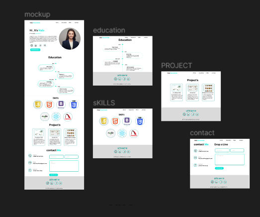
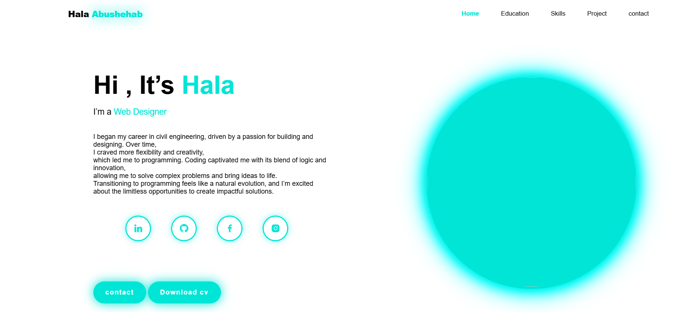

# -portfolio-website

# I made a creative portfolio for the UI Designer and Developers which has Five creative pages including Home, Works, Case Study, Blog, and Contact.
I created a personal portfolio website using HTML and CSS. I designed it from scratch, creating both wireframes and mockups to ensure a user-friendly and visually appealing layout.

 **MOCKUP**

 **PORTFOLIO**

# This project was designed using modern technologies to ensure performance and quality[figma].

  -PORTFOLIO
  [link](https://halaabushehab.github.io/-portfolio-website/)

  -Wireframe +mockup
  [link]( https://www.figma.com/design/sSLkrTaUM2d1yDBIVwp9y1/Untitled?node-id=0-1&p=f&t=YgIWiYFFOa36Vz5Y-0 )